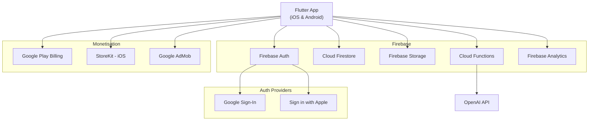
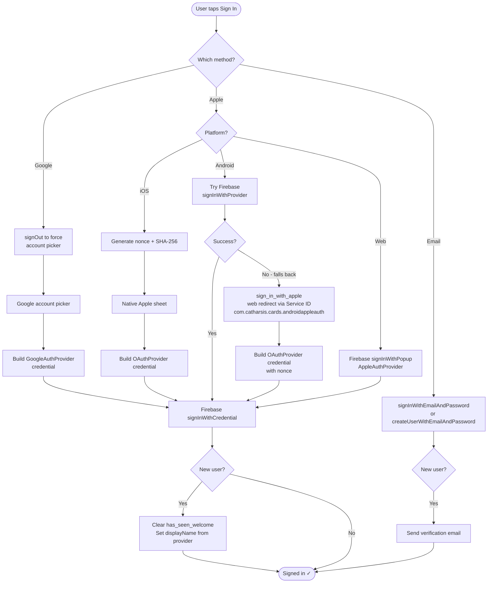
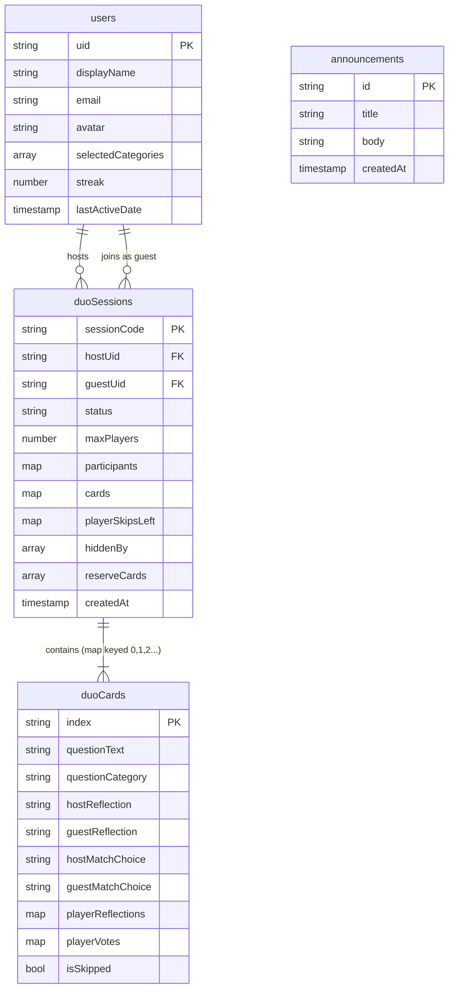
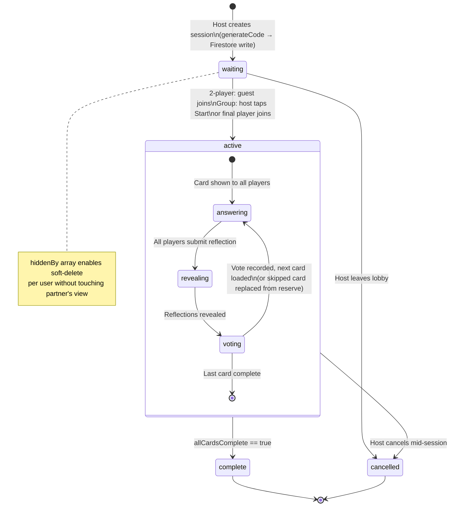

# Catharsis Cards — Project Handover Documentation

**Package:** `com.catharsis.cards`  
**Current version:** 3.0.2  
**Platforms:** iOS and Android  
**Framework:** Flutter (Dart)

---

## Table of Contents

1. [What the App Does](#1-what-the-app-does)
2. [Tech Stack](#2-tech-stack)
3. [Project Structure](#3-project-structure)
4. [Firebase Setup](#4-firebase-setup)
5. [Features In Depth](#5-features-in-depth)
6. [Data Models](#6-data-models)
7. [Subscriptions & Monetisation](#7-subscriptions--monetisation)
8. [Theming System](#8-theming-system)
9. [State Management & Providers](#9-state-management--providers)
10. [Navigation & Routing](#10-navigation--routing)
11. [Local Storage](#11-local-storage)
12. [Notifications](#12-notifications)
13. [Assets & Content](#13-assets--content)
14. [Android Build Configuration](#14-android-build-configuration)
15. [iOS Build Configuration](#15-ios-build-configuration)
16. [CI/CD Pipeline](#16-cicd-pipeline)
17. [Environment Variables & Secrets](#17-environment-variables--secrets)
18. [Running the Project Locally](#18-running-the-project-locally)
19. [Publishing](#19-publishing)
20. [Known Constraints & Technical Debt](#20-known-constraints--technical-debt)
21. [Third-Party Services Summary](#21-third-party-services-summary)
22. [Useful Documentation Links](#22-useful-documentation-links)

---

## 1. What the App Does

Catharsis Cards is a self-reflection and conversation-starter app. Users swipe through thought-provoking questions across five emotional and philosophical categories. Questions can be liked, saved with personal written reflections, and filtered by category. The app tracks a daily engagement streak.

The main social feature is **Circle mode** (the codebase calls it "duo mode" internally — this is a naming legacy from earlier versions). Circle mode lets 2–4 users join the same real-time session using a 6-character invite code. Each player answers the same question independently, then everyone reveals their answers simultaneously and votes whether they matched or differed. After all cards are played a visual recap slideshow summarises the session. Completed sessions are stored and can be reviewed later.

Premium features are gated behind a subscription, purchased through native in-app purchase systems on both platforms.

---

## 2. Tech Stack

| Layer | Technology |
|---|---|
| Framework | Flutter (Dart). SDK `>=3.7.0 <4.0.0` |
| Backend / database | Firebase (Firestore, Auth, Storage, Functions, Analytics) |
| State management | Riverpod (`flutter_riverpod`) |
| Navigation | GoRouter (`go_router`) via `app_router.dart` |
| Local persistence | Hive (structured objects), SharedPreferences (key-value flags) |
| In-app purchases | `in_app_purchase` Flutter plugin — Google Play Billing 8.x on Android, StoreKit on iOS |
| AI question generation | OpenAI API, called server-side via Firebase Cloud Function `generateQuestions` |
| Notifications | `awesome_notifications` (local only, no push) |
| Ads | Google Mobile Ads (`google_mobile_ads`) — shown to free users only |
| Authentication | Firebase Auth + Google Sign-In + Sign In with Apple |
| Fonts | Google Fonts + custom "Runtime" OTF (bundled as asset) |
| Animation | `flutter_animate`, standard Flutter `AnimationController` |
| Images | `cached_network_image` for remote images |
| CI/CD | GitHub Actions |

### Architecture Overview



### A note on FlutterFlow

The app was originally bootstrapped using **FlutterFlow**, a low-code Flutter builder. This is why a `lib/flutter_flow/` directory exists — it contains FlutterFlow-generated utility wrappers (`flutter_flow_theme.dart`, `flutter_flow_util.dart`, `flutter_flow_swipeable_stack.dart`, etc.). The app has since grown well beyond the generated code, but those files are still present and some pages still reference FlutterFlow helpers. Be careful when updating these files — they are used in ways that may not be obvious.

---

## 3. Project Structure

```
CatharsisMobileApp/
├── android/
│   ├── app/build.gradle.kts      Main Android build config (SDK versions, signing)
│   └── build.gradle.kts          Root Gradle (repositories only)
│
├── ios/
│   └── Runner/                   Standard Flutter iOS project
│
├── functions/                    Firebase Cloud Functions (deployed separately)
│
├── assets/
│   ├── images/                   All image assets (icons, backgrounds, avatars, themes)
│   ├── fonts/Runtime.otf         Custom display font used throughout the UI
│   ├── Card_Statements_Questions.csv   Solo mode question bank
│   └── Duo_Questions.csv               Circle mode question bank
│
├── lib/
│   ├── main.dart                 App entry point: Firebase init, Hive setup, ads, runApp
│   ├── app_router.dart           GoRouter configuration — all routes defined here
│   ├── index.dart                Barrel export file (generated by FlutterFlow)
│   ├── firebase_options.dart     Firebase platform config (auto-generated, do not edit)
│   │
│   ├── flutter_flow/             FlutterFlow-generated utilities (legacy, still used)
│   │   ├── flutter_flow_theme.dart
│   │   ├── flutter_flow_util.dart
│   │   └── flutter_flow_swipeable_stack.dart
│   │
│   ├── models/
│   │   ├── duo_session.dart      DuoSession + DuoCard data models + Firestore serialization
│   │   └── announcement.dart     Announcement model (for in-app notices)
│   │
│   ├── components/               Reusable UI widgets
│   │   ├── circle_mode_icon.dart         Circle mode icon on a coloured disc
│   │   ├── subscription_offer_popup.dart Paywall popup shown to free users
│   │   ├── swipe_limit_popup.dart        Shown when free users hit their swipe limit
│   │   ├── announcement_popup.dart       In-app announcement overlay
│   │   ├── promotion_popup.dart          Promotional offer overlay
│   │   ├── reflection_bottom_sheet.dart  Slide-up sheet for writing reflections
│   │   └── gamecard_widget.dart          The actual question card rendered in the swipe deck
│   │
│   ├── pages/
│   │   ├── home_page/            Main swipe deck (home_page_widget.dart + home_page_model.dart)
│   │   ├── duo_mode/             All Circle mode screens
│   │   │   ├── duo_lobby_page.dart       Waiting room before a session starts
│   │   │   ├── duo_swipe_page.dart       Real-time card screen during an active session
│   │   │   ├── duo_summary_page.dart     Per-card summary/reveal screen
│   │   │   ├── duo_wrap_page.dart        Post-session recap slideshow
│   │   │   ├── duo_past_sessions_page.dart   History of completed sessions
│   │   │   └── duo_tutorial_page.dart    Circle mode onboarding
│   │   ├── auth/                 Login page, email verification
│   │   ├── profile/              User profile
│   │   ├── liked_cards/          List of liked/saved cards with reflections
│   │   ├── subscription_plans/   Subscription purchase screen
│   │   ├── main_settings/        App settings (theme, categories, account)
│   │   ├── account_settings/     Account-specific settings (delete account, etc.)
│   │   ├── theme_settings/       Theme selector
│   │   ├── streak_page/          Daily streak display
│   │   ├── announcements/        In-app announcement centre
│   │   ├── tutorial_page/        How It Works tutorial (shown at signup and from settings)
│   │   └── welcome_screen/       First-run welcome
│   │
│   ├── provider/                 Riverpod providers
│   │   ├── auth_provider.dart
│   │   ├── theme_provider.dart
│   │   ├── app_state_provider.dart
│   │   ├── duo_provider.dart
│   │   ├── user_profile_provider.dart
│   │   ├── subscription_offer_provider.dart
│   │   ├── reflection_provider.dart
│   │   ├── streak_provider.dart
│   │   ├── seen_cards_provider.dart
│   │   ├── pop_up_provider.dart
│   │   ├── announcements_provider.dart
│   │   ├── promotion_provider.dart
│   │   └── tutorial_state_provider.dart
│   │
│   └── services/                 Business logic + external integrations
│       ├── auth_service.dart           Sign in/out (Google, Apple, email)
│       ├── subscription_service.dart   Purchase flow + premium status
│       ├── duo_session_service.dart    Firestore reads/writes for Circle sessions
│       ├── duo_questions_service.dart  Loads and caches Circle mode questions
│       ├── questions_service.dart      Loads solo mode questions from CSV
│       ├── openai_service.dart         Calls Cloud Function to generate AI questions
│       ├── notification_service.dart   Local notification scheduling
│       ├── ad_service.dart             Google Mobile Ads initialisation + display
│       ├── reflection_service.dart     Saves/loads user reflections
│       ├── streak_service.dart         Daily streak tracking
│       ├── user_profile_service.dart   Firestore user profile reads/writes
│       ├── category_stats_service.dart Tracks per-category engagement for card weighting
│       ├── user_behavior_service.dart  Tracks swipe counts + free-tier limits
│       ├── announcements_service.dart  Fetches announcements from Firestore
│       ├── promotion_service.dart      Manages promotional offers
│       └── account_deletion_service.dart Handles permanent account deletion
│
├── pubspec.yaml                  Dependencies + asset declarations
├── HANDOVER.md                   This document
└── .github/workflows/release.yml GitHub Actions CI build
```

---

## 4. Firebase Setup

The app uses a single Firebase project. All platform config files (`google-services.json` for Android, `GoogleService-Info.plist` for iOS) are excluded from the repository and must be obtained from the Firebase console.

### Firebase Auth
### Authentication Flow



Three sign-in methods are enabled:
- **Email/password** — with email verification on new registrations
- **Google Sign-In** — forces the account picker on every sign-in to prevent auto-login confusion
- **Sign in with Apple** — required by App Store guidelines when Google Sign-In is offered. Implemented for iOS (native), Android (via Firebase provider with web fallback), and web. Apple sign-in on Android uses a nonce + SHA-256 flow for security.

### Cloud Firestore
Key collections:

| Collection | Document ID | Purpose |
|---|---|---|
| `users` | Firebase Auth UID | User profile, preferences, streak data |
| `duoSessions` | Session code (6-char) | Circle mode sessions — the code IS the document ID |
| `announcements` | Auto-generated | In-app notices shown to all users |

**Note:** Subscription status is **not stored in Firestore** — it is stored locally in SharedPreferences and validated against the device's purchase receipts. See §7.

### Cloud Firestore — duoSessions document structure

```
duoSessions/{sessionCode}
  hostUid: string
  hostName: string
  guestUid: string | null        ← first non-host joiner (kept for backward compat)
  guestName: string | null
  status: "waiting" | "active" | "complete" | "cancelled"
  maxPlayers: int                ← 2 = classic duo, 3–4 = group mode
  participants: { uid: name }    ← all players including host
  playerSkipsLeft: { uid: int }  ← group mode skip budgets
  hostSkipsLeft: int             ← classic 2-player skip count
  guestSkipsLeft: int
  hiddenBy: [uid, ...]           ← soft-delete: UIDs who have dismissed this from history
  reserveCards: [{ text, category }]   ← spare questions for skip replacements
  createdAt: Timestamp
  cards: {
    "0": { questionText, questionCategory, hostReflection, guestReflection,
           hostMatchChoice, guestMatchChoice, isSkipped,
           playerReflections: { uid: text }, playerVotes: { uid: "matched"|"differed" } }
    "1": { ... }
    ...
  }
```

Cards are stored as a **Firestore map keyed by string index** (not an array). This enables atomic field-level updates using dot notation (e.g. `cards.2.hostMatchChoice`) without rewriting the entire array, which is important for real-time multi-user updates.

### Firestore Data Model



### Firebase Storage
Profile avatar images. Stored at `avatars/{uid}.jpg`. Uploaded from the profile page.

### Firebase Analytics
Standard automatic event tracking. No custom events currently implemented.

### Cloud Functions
One deployed function:
- **`generateQuestions`** — called by `OpenAIService`. Accepts `{ category, count }`, calls the OpenAI API server-side (so the API key never ships in the app binary), and returns `{ questions: [...] }`.

The Cloud Functions project lives in the `functions/` directory at the project root.

---

## 5. Features In Depth

### Solo card swiping
The home screen shows a swipeable card stack loaded from `Card_Statements_Questions.csv`. Swiping left passes a question and deprioritises its category for the user. Swiping right signals interest. Double-tapping a card likes it and opens a reflection text field. Liked cards appear in the Liked Cards tab.

Free users have a daily swipe limit enforced by `user_behavior_service.dart`. When the limit is reached, `swipe_limit_popup.dart` is shown with an upsell to subscribe.

### AI question generation
`openai_service.dart` calls the `generateQuestions` Cloud Function, which uses the OpenAI API to produce new questions in a given category. Generated questions are returned as `Question` objects and inserted into the card deck. The OpenAI API key is stored only server-side in the Cloud Function environment — never in the app.

### Categories
Five categories, each with a dedicated icon asset:
- Love & Intimacy
- Spirituality
- Society
- Relationships
- Personal Development

### Liked cards & reflections
`reflection_service.dart` manages saving and loading reflections. Reflections are tied to liked questions and persisted in Firestore under the user's profile. The `liked_cards_widget.dart` page shows all saved questions with their reflections.

### Daily streak
`streak_service.dart` and `streak_provider.dart` track how many consecutive days the user has opened the app. The streak is displayed on the streak page and used as a motivational hook.

### Announcements
`announcements_service.dart` fetches documents from the `announcements` Firestore collection and displays them via `announcement_popup.dart`. Useful for in-app messaging without a release.

### Promotions
`promotion_service.dart` manages time-limited promotional offers (e.g. discounted subscription). The offer popup (`promotion_popup.dart`) is shown based on conditions defined in the service.

### Circle mode
Circle mode is the real-time multiplayer feature. The code throughout the project calls it "duo mode" — this is a legacy name that predates the public renaming. All Circle mode logic lives in `lib/pages/duo_mode/` and `lib/services/duo_session_service.dart`.

**Session state machine:**



**Session flow:**
1. Host creates a session — `duo_session_service.dart` writes a document to `duoSessions` with status `waiting` and the card deck pre-loaded.
2. Host shares the 6-character session code with others.
3. Guests enter the code in the join screen → `joinSession()` is called → on the second player joining a 2-player session, status flips to `active` automatically. For group sessions (3–4 players), the host can also manually start from the lobby.
4. Both sides navigate to `duo_swipe_page.dart` and see the same question. Each types their reflection privately.
5. Once both have submitted, `duo_summary_page.dart` reveals both answers and each player votes matched/differed.
6. Either player can skip a card (3 skips per player). The skipped card is replaced by a reserve question. The other player sees a banner: "[Name] skipped this card."
7. After the last card, `duo_wrap_page.dart` plays the recap slideshow.
8. The session is marked `complete` in Firestore and appears in Past Sessions.

**Real-time sync:** `duo_session_service.dart` exposes `streamSession(code)` which wraps a Firestore `snapshots()` stream. All pages listen to this stream via `duo_provider.dart` — whenever any player writes to Firestore, all connected clients update instantly.

**Session deletion (soft):** Deleting a session adds the user's UID to `hiddenBy`. The document stays in Firestore; it's just filtered out when fetching that user's past sessions. The partner's history is unaffected.

---

## 6. Data Models

### Question (`questions_model.dart`)
Simple model with `text` (string) and `category` (string). The Hive adapter (`QuestionAdapter` in `questions_model.g.dart`) allows Questions to be cached locally. Do not edit `.g.dart` files by hand — regenerate with `flutter pub run build_runner build`.

### DuoCard (`models/duo_session.dart`)
Represents one question card within a session. Contains reflections, match choices, and player vote maps. Derived getters (`isComplete`, `isMatch`, `isSplit`, `bothDiffered`) compute card state from the raw fields without touching Firestore.

### DuoSession (`models/duo_session.dart`)
The full session document. The `sessionCode` field is the Firestore document ID. Key methods:
- `currentCardIndex` — finds the first incomplete card; returns -1 when all done
- `matchedCards` / `splitCards` — used by the recap slideshow
- `cardIsComplete(i)` — group-mode-aware completion check

---

## 7. Subscriptions & Monetisation

### Product IDs

| Platform | Monthly | Annual |
|---|---|---|
| Android (Google Play) | `monthly_subscription` | `annual_subscription` |
| iOS (App Store) | `com.catharsis.cards.monthly` | `com.catharsis.cards.annual` |

These must exactly match the product IDs configured in Google Play Console and App Store Connect.

### How premium status is stored

Premium status is stored **locally on the device** in SharedPreferences — not in Firestore. Three keys are used:

| Key | Type | Purpose |
|---|---|---|
| `is_premium` | bool | Cached premium flag |
| `subscription_expiry` | int (epoch ms) | When the subscription period ends |
| `subscription_type` | string | `"monthly"` or `"annual"` |

On app startup, `SubscriptionService.init()` checks the expiry timestamp against the current time. If valid, the user is granted premium instantly (no network call). If expired, the flag is revoked. `restorePurchases()` is then called to sync with the store backend and catch any renewals.

### Purchase flow
1. `SubscriptionService.init()` queries available products from the store.
2. The subscription plans page calls `SubscriptionService.purchase(id)`.
3. The native purchase sheet is shown.
4. `_listenToPurchaseUpdated()` receives the result. On success, `_grantSubscription()` writes the expiry date to SharedPreferences and notifies `isPremiumProvider`.
5. `isPremiumProvider` is a Riverpod `StreamProvider` — any widget watching it rebuilds automatically when status changes.

### Ads
`ad_service.dart` wraps Google Mobile Ads. Ads are only shown to non-premium users. Ad unit IDs are loaded from `.env` at build time.

---

## 8. Theming System

Three themes are supported, selected in `theme_settings_page.dart` and persisted in SharedPreferences:

| Theme name | Look |
|---|---|
| `catharsis_signature` | Warm off-white/parchment tones with a texture overlay — the default |
| `dark` | Dark backgrounds, white text, uses `dark_mode_background.png` |
| `light` | Clean light tones, uses `light_mode_background.png` |

`ThemeProvider` (Riverpod) holds the active theme name and the resolved `ThemeData`. The `CustomThemeExtension` exposes additional app-specific colour tokens (accent colour, font colour, card background) to all widgets.

Pages switch backgrounds, icon colours, and text colours by reading the current palette via `ref.watch(themeProvider)`. Look for `_paletteForTheme(context)` or similar patterns in page files to understand how it's applied.

---

## 9. State Management & Providers

The app uses Riverpod throughout. All stateful pages extend `ConsumerStatefulWidget`. Key providers:

| Provider | File | Purpose |
|---|---|---|
| `authStateProvider` | `provider/auth_provider.dart` | Firebase Auth state stream |
| `themeProvider` | `provider/theme_provider.dart` | Active theme + ThemeData |
| `subscriptionServiceProvider` | `services/subscription_service.dart` | Singleton SubscriptionService |
| `isPremiumProvider` | `services/subscription_service.dart` | StreamProvider for premium status |
| `userProfileProvider` | `provider/user_profile_provider.dart` | Logged-in user's Firestore profile |
| `cardStateProvider` | `provider/app_state_provider.dart` | Swipe deck state (current card, liked, etc.) |
| `duoProvider` | `provider/duo_provider.dart` | Active Circle session stream |
| `reflectionProvider` | `provider/reflection_provider.dart` | User's saved reflections |
| `streakProvider` | `provider/streak_provider.dart` | Daily streak state |
| `tutorialProvider` | `provider/tutorial_state_provider.dart` | Whether tutorial has been seen (per user) |
| `popUpProvider` | `provider/pop_up_provider.dart` | Controls which popup is currently shown |

In `main.dart`, `ref.listen(authStateProvider, ...)` watches for login/logout events and invalidates user-specific providers to prevent state leaking between user sessions.

---

## 10. Navigation & Routing

### Screen Navigation Map

```mermaid
flowchart TD
    Start([App launch]) --> AuthGuard{Logged in?}
    AuthGuard -->|No| Login[/auth/login]
    AuthGuard -->|Yes| TutGuard{Seen tutorial?}
    TutGuard -->|No| Tutorial[/tutorial]
    TutGuard -->|Yes| NavBar

    Login --> NavBar
    Tutorial --> NavBar

    subgraph NavBar [NavBar Shell — 3 tabs]
        Home[/home\nSwipe deck]
        Profile[/profile]
        Liked[/liked-cards]
    end

    Home --> Circle[/duo/hub\nCircle Mode Hub]
    Circle -->|Create| Lobby[/duo/lobby\nWaiting room]
    Circle -->|Join with code| Lobby
    Lobby --> DuoSwipe[/duo/swipe\nActive session]
    DuoSwipe --> Summary[/duo/summary\nCard reveal + vote]
    Summary -->|Next card| DuoSwipe
    Summary -->|Session done| Wrap[/duo/wrap\nRecap slideshow]

    Profile --> Settings[/settings]
    Profile --> Theme[/settings/theme]
    Profile --> Account[/settings/account]
    Profile --> Plans[/subscription-plans\nPaywall]
    Profile --> Past[/duo/past-sessions]
    Profile --> Streak[/streak]
    Profile --> Announcements[/announcements]

    Past --> Wrap
```

All routes are defined in `lib/app_router.dart`. The router is created in `_MyAppState.initState()` and passed to `MaterialApp.router`.

The router is refreshed (`_router.refresh()`) when auth state changes or the tutorial state changes, which causes GoRouter to re-evaluate its redirect guards. This is how unauthenticated users are redirected to the login page and new users are sent to the tutorial.

`NavBarPage` (in `main.dart`) is the bottom-tab shell that hosts the three main tabs: Home, Profile, and Liked Cards.

---

## 11. Local Storage

**SharedPreferences** — lightweight flags:
- `is_premium`, `subscription_expiry`, `subscription_type` — premium status
- `has_seen_tutorial_{uid}` — per-user tutorial completion flag
- `duo_skip_delete_confirm` — skip the "confirm delete session" dialog
- `selected_theme`, `is_dark_mode` — theme preferences
- Various swipe/usage counters managed by `user_behavior_service.dart`

**Hive** — structured local cache. Boxes used:
- `likedQuestions_{uid}` — locally cached liked questions (typed as `Box<Question>`)
- `cachedQuestions` / `seenQuestions` — swipe deck cache to avoid repeats
- `duoQuestionsCache` — Circle mode question cache

The `QuestionAdapter` registered in `main.dart` is the Hive serializer for the `Question` model. It lives in `questions_model.g.dart` — do not edit this file by hand. Regenerate it with `flutter pub run build_runner build` if the `Question` model changes.

---

## 12. Notifications

`notification_service.dart` wraps `awesome_notifications`. Notifications are **local only** — no Firebase Cloud Messaging (FCM) or server-sent push notifications are implemented. The `promptUser: false` flag in `main.dart` means notification permission is not requested at launch; request it contextually.

The action handler `NotificationService.onNotificationTapMethod` is registered with `AwesomeNotifications().setListeners()` before `runApp`. This ensures taps on notifications (including cold-start taps) are received before the widget tree builds.

`minSdkVersion 23` on Android is a hard requirement from `awesome_notifications`. This is hardcoded in `android/app/build.gradle.kts` and must not be changed.

---

## 13. Assets & Content

### Question banks
Questions ship with the app binary as CSV files. To add or remove questions, update the CSVs and release a new version. There is no CMS or remote content delivery.

### Image assets

| Asset | Used for |
|---|---|
| `circle_icon.png` | Circle mode button (home screen) and tutorial |
| `background_texture.png` | Signature theme texture overlay |
| `dark_mode_background.png` / `light_mode_background.png` / `default_mode_background.png` | Theme backgrounds |
| `boat_illustration.png` | Onboarding/welcome illustration |
| `app_icon.jpeg` | App launcher icon source |
| `app_icon_foreground.png` | Android adaptive icon foreground |
| `avatar1.png` … `avatar6.png` | Selectable user avatars |
| Category icons | `spirituality_icon.png`, `society_icon.png`, `love_intimacy_icon.png`, etc. |

### Custom font
`Runtime.otf` is the primary display font used for all headings and most body text. Declared under `fonts:` in `pubspec.yaml`.

---

## 14. Android Build Configuration

File: `android/app/build.gradle.kts`

```
compileSdk = 36
minSdk     = 23   ← hardcoded; awesome_notifications requires 23+
targetSdk  = 36   ← required by Google Play API level mandate
NDK        = 27.0.12077973
```

**Release signing:** Configured via `android/key.properties` (gitignored). Create this file locally:

```properties
storeFile=../your-keystore.jks   # relative to android/app/
storePassword=...
keyAlias=...
keyPassword=...
```

The keystore file itself must also be present on disk. Without `key.properties`, builds fall back to debug signing and **cannot be published to the Play Store**.

**Google Play Billing:** Uses `in_app_purchase_android 0.5.2`, which natively declares `com.android.billingclient:billing:8.0.0`. No manual Gradle overrides are needed.

---

## 15. iOS Build Configuration

Standard Flutter iOS project. Points to note:

- **Sign in with Apple** capability must be enabled in Xcode and in App Store Connect for the app ID.
- **Apple Sign-In on Android** uses a web-based OAuth flow via Firebase, requiring the Apple Service ID `com.catharsis.cards.androidappleauth` and redirect URI `https://catharsiscards.firebaseapp.com/__/auth/handler` configured in the Apple Developer portal.

To build a release iOS archive:
```bash
flutter build ipa --release
```

---

## 16. CI/CD Pipeline

File: `.github/workflows/release.yml`

Triggers on every push to `main` and on pull requests targeting `main`.

```mermaid
flowchart LR
    Push([Push to main]) --> CO[Checkout repo]
    CO --> ENV["Write .env\nfrom OPENAI_API_KEY"]
    ENV --> GS["Write google-services.json\nfrom GOOGLE_SERVICES_JSON"]
    GS --> FL[Setup Flutter\nlatest stable channel]
    FL --> KS["Decode KEYSTORE_BASE64\n→ android/app/release.jks"]
    KS --> KP["Write key.properties\nfrom signing secrets"]
    KP --> PG[flutter pub get]
    PG --> BU[flutter build appbundle\n--release]
    BU --> UP[Upload app-release.aab\nas Actions artifact]
    UP --> Manual([Download & upload\nmanually in Play Console])
```



Steps:
1. Checkout repository
2. Create `.env` from `OPENAI_API_KEY` secret
3. Write `android/app/google-services.json` from `GOOGLE_SERVICES_JSON` secret
4. Install Flutter (latest stable channel — no version pinned)
5. Decode base64 keystore from `KEYSTORE_BASE64` into `android/app/release.jks`
6. Create `android/key.properties` from signing secrets
7. `flutter pub get`
8. `flutter build appbundle --release`
9. Upload the `.aab` as a GitHub Actions artifact (`app-release.aab`)

The AAB is **not** automatically submitted to Google Play — download it from the Actions run and upload manually in Play Console.

### Required GitHub Secrets

| Secret | Description |
|---|---|
| `OPENAI_API_KEY` | OpenAI API key (written to `.env` at build time) |
| `GOOGLE_SERVICES_JSON` | Full contents of `android/app/google-services.json` |
| `KEYSTORE_BASE64` | Android keystore `.jks` file, base64-encoded |
| `KEYSTORE_PASSWORD` | Keystore store password |
| `KEY_ALIAS` | Key alias within the keystore |
| `KEY_PASSWORD` | Key password |

---

## 17. Environment Variables & Secrets

A `.env` file in the project root is loaded at runtime via `flutter_dotenv`. It must contain:

```
OPENAI_API_KEY=sk-...
```

This file is gitignored. The CI pipeline creates it from a GitHub secret. Create it locally by hand.

Firebase credentials are also gitignored:
- `android/app/google-services.json` — from Firebase console → Project settings → Android app
- `ios/Runner/GoogleService-Info.plist` — from Firebase console → Project settings → iOS app

---

## 18. Running the Project Locally

### Prerequisites
- Flutter SDK, stable channel (latest)
- Xcode (Mac only, required for iOS builds)
- Android SDK / Android Studio
- Firebase project with Auth, Firestore, Storage, Analytics, and Cloud Functions enabled

### Setup

```bash
# 1. Clone the repository
git clone https://github.com/your-org/CatharsisMobileApp.git
cd CatharsisMobileApp

# 2. Create the .env file
echo "OPENAI_API_KEY=your-key" > .env

# 3. Add Firebase config
#    Copy google-services.json to android/app/
#    Copy GoogleService-Info.plist to ios/Runner/

# 4. For Android release signing, create android/key.properties (see §14)

# 5. Install dependencies
flutter pub get

# 6. Run on device/emulator
flutter run

# 7. Build Android release bundle
flutter build appbundle --release

# 8. Build iOS release archive
flutter build ipa --release
```

### Useful commands

```bash
flutter clean                    # Clear build caches — use when builds misbehave
flutter pub upgrade <package>    # Upgrade a specific package
flutter pub run build_runner build --delete-conflicting-outputs  # Regenerate Hive adapters
flutter analyze                  # Static analysis
```

### Debug utilities
`DebugUtils` at the bottom of `main.dart` has helpers for inspecting SharedPreferences state and clearing tutorial flags during development.

---

## 19. Publishing

### Android (Google Play)

1. Increment `version` in `pubspec.yaml` (e.g. `3.0.3+56`) — both version name and build number must increase.
2. `flutter build appbundle --release`
3. The signed `.aab` is at `build/app/outputs/bundle/release/app-release.aab`
4. Upload in Google Play Console → your app → Production → Create new release.

### iOS (App Store)

1. Increment `version` in `pubspec.yaml`.
2. `flutter build ipa --release`
3. Upload via Xcode Organiser or Transporter.
4. Create new version in App Store Connect, attach the build, submit for review.

---

## 20. Known Constraints & Technical Debt

**Subscription stored locally only.** Premium status in SharedPreferences is cleared if the user uninstalls the app or clears app data. Users must tap "Restore Purchases" to recover. Consider server-side receipt validation for greater robustness.

**Questions bundled in the binary.** Updating questions requires an app release. A remote content system would remove this constraint.

**FlutterFlow legacy code.** `lib/flutter_flow/` contains auto-generated code from the app's original build. Some files may contain unused utilities. Approach carefully.

**No automated tests.** There is no test suite. Refactoring should be tested manually on both platforms.

**Kotlin / Gradle version warnings.** Several plugins still apply the Kotlin Gradle Plugin, which Flutter is deprecating. Not breaking today but will need addressing.

**"Duo mode" vs "Circle mode" naming.** The codebase uses `duo` everywhere (files, classes, Firestore collection `duoSessions`). The public UI says "Circle". Be aware of this split.

**No push notifications.** All notifications are local. Adding server-side push would require Firebase Cloud Messaging setup and Cloud Functions.

---

## 21. Third-Party Services Summary

| Service | Purpose | Dashboard |
|---|---|---|
| Firebase | Auth, Firestore, Storage, Analytics, Functions | [console.firebase.google.com](https://console.firebase.google.com) |
| OpenAI | AI question generation (server-side via Cloud Function) | [platform.openai.com](https://platform.openai.com) |
| Google Play Console | Android distribution + Play Billing products | [play.google.com/console](https://play.google.com/console) |
| App Store Connect | iOS distribution + StoreKit products | [appstoreconnect.apple.com](https://appstoreconnect.apple.com) |
| Google AdMob | In-app advertising for free users | [admob.google.com](https://admob.google.com) |
| Apple Developer Portal | iOS signing certs, App ID, Apple Sign-In config | [developer.apple.com](https://developer.apple.com) |
| GitHub | Source control + CI/CD | Your organisation's GitHub account |

### What you need to fully take over

- Owner access to the Firebase project
- Owner/Admin on Google Play Console
- Owner/Admin on App Store Connect
- Owner on Apple Developer account
- The Android keystore `.jks` file and all its passwords — **without this, Android updates cannot be published**
- iOS distribution certificate + provisioning profile
- All GitHub secrets listed in §16
- The OpenAI API key

---

## 22. Useful Documentation Links

### Flutter & Dart
- [Flutter documentation](https://docs.flutter.dev) — the main reference for everything Flutter
- [Dart language tour](https://dart.dev/language) — good starting point if Dart is new to you
- [Flutter cookbook](https://docs.flutter.dev/cookbook) — practical recipes for common tasks
- [pub.dev](https://pub.dev) — Flutter/Dart package registry, with changelogs for every dependency

### Firebase
- [Firebase console](https://console.firebase.google.com)
- [FlutterFire overview](https://firebase.flutter.dev/docs/overview) — how Firebase packages work in Flutter
- [Cloud Firestore Flutter guide](https://firebase.flutter.dev/docs/firestore/overview)
- [Firebase Auth Flutter guide](https://firebase.flutter.dev/docs/auth/overview)
- [Firebase Cloud Functions guide](https://firebase.google.com/docs/functions/get-started) — for the `generateQuestions` function
- [Firestore security rules](https://firebase.google.com/docs/firestore/security/get-started) — check `firestore.rules` in the project root

### State Management
- [Riverpod documentation](https://riverpod.dev/docs/introduction/why_riverpod) — covers providers, ConsumerWidget, StateNotifier
- [Riverpod migration guide](https://riverpod.dev/docs/migration/from_change_notifier) — useful if upgrading Riverpod versions

### Navigation
- [GoRouter documentation](https://pub.dev/packages/go_router) — routing, redirects, deep links
- [GoRouter migration guide](https://docs.flutter.dev/release/breaking-changes/go-router-v10) — check when upgrading

### In-App Purchases
- [in_app_purchase Flutter plugin](https://pub.dev/packages/in_app_purchase)
- [in_app_purchase_android changelog](https://pub.dev/packages/in_app_purchase_android/changelog) — check before upgrading; breaking changes are common
- [Google Play Billing Library docs](https://developer.android.com/google/play/billing/integrate)
- [Google Play Billing Library release notes](https://developer.android.com/google/play/billing/release-notes)
- [Google Play Billing deprecation FAQ](https://developer.android.com/google/play/billing/deprecation-faq) — version enforcement deadlines
- [App Store subscriptions guide](https://developer.apple.com/in-app-purchase/) — Apple's IAP documentation

### Local Storage
- [Hive documentation](https://docs.hivedb.dev) — local database, TypeAdapters, box management
- [shared_preferences plugin](https://pub.dev/packages/shared_preferences)

### Notifications
- [awesome_notifications documentation](https://pub.dev/packages/awesome_notifications) — setup, channels, action handlers
- [awesome_notifications Android requirements](https://pub.dev/packages/awesome_notifications#-android-setup) — minSdk 23 requirement explained

### Authentication
- [Sign in with Apple — Flutter](https://pub.dev/packages/sign_in_with_apple)
- [Google Sign-In — Flutter](https://pub.dev/packages/google_sign_in)
- [Apple Sign-In on Android setup](https://firebase.google.com/docs/auth/android/apple) — Service ID and redirect URI configuration
- [Apple Developer — Sign in with Apple](https://developer.apple.com/sign-in-with-apple/)

### Android Publishing
- [Google Play Console help](https://support.google.com/googleplay/android-developer)
- [Android app bundle guide](https://developer.android.com/guide/app-bundle)
- [Android Gradle Plugin release notes](https://developer.android.com/build/releases/gradle-plugin) — check when upgrading AGP
- [Gradle compatibility matrix](https://developer.android.com/build/releases/gradle-plugin#updating-gradle) — Gradle ↔ AGP version compatibility

### iOS Publishing
- [App Store Connect help](https://developer.apple.com/help/app-store-connect/)
- [Transporter — upload builds](https://apps.apple.com/us/app/transporter/id1450874784)
- [iOS code signing guide](https://developer.apple.com/support/code-signing/)
- [Flutter iOS deployment](https://docs.flutter.dev/deployment/ios)

### Ads
- [Google Mobile Ads Flutter plugin](https://pub.dev/packages/google_mobile_ads)
- [AdMob console](https://admob.google.com) — manage ad units and view revenue

### OpenAI
- [OpenAI API reference](https://platform.openai.com/docs/api-reference)
- [OpenAI platform dashboard](https://platform.openai.com) — manage API keys and usage

### CI/CD
- [GitHub Actions documentation](https://docs.github.com/en/actions)
- [subosito/flutter-action](https://github.com/subosito/flutter-action) — the Flutter GitHub Action used in the workflow

---

*Last updated: August 2026*
